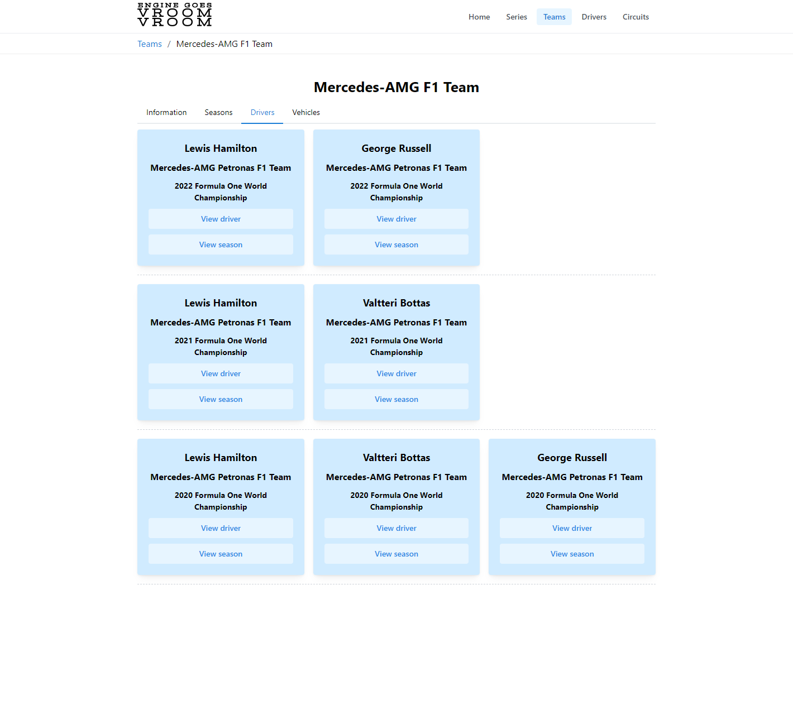
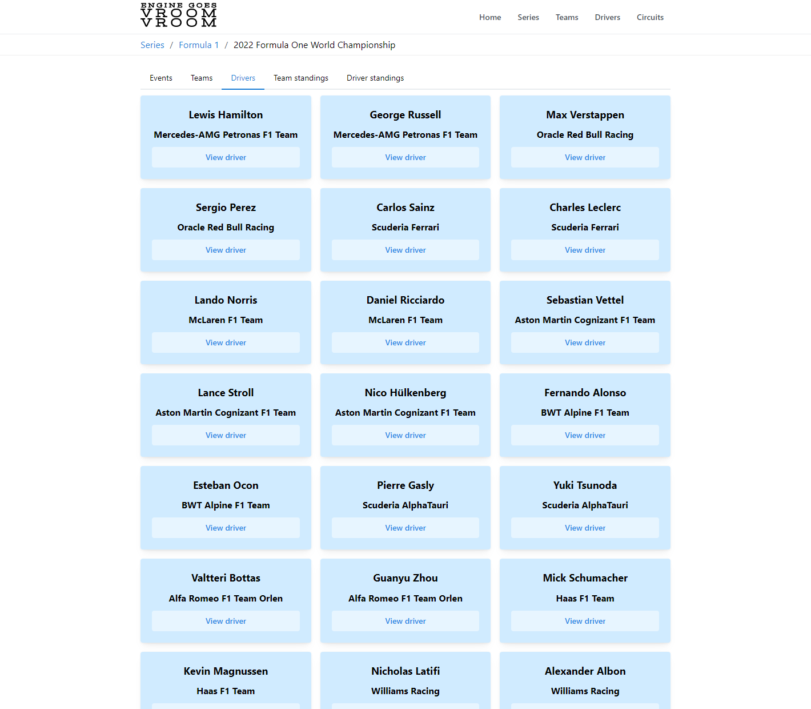
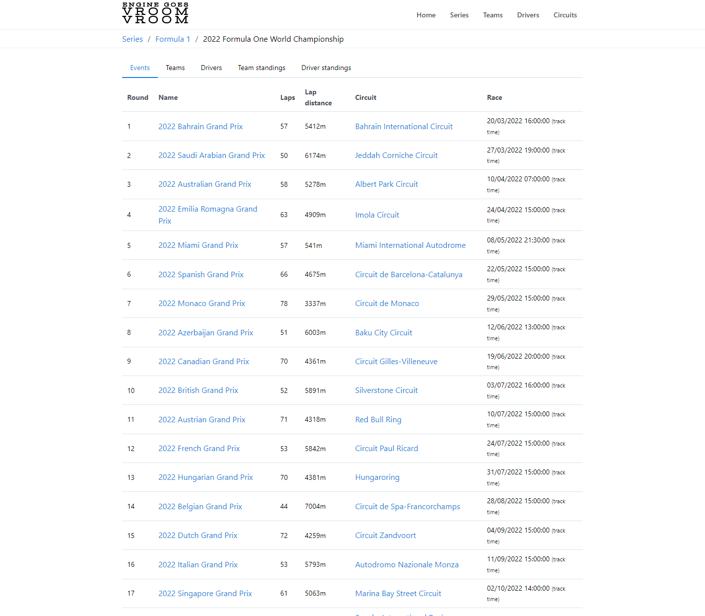
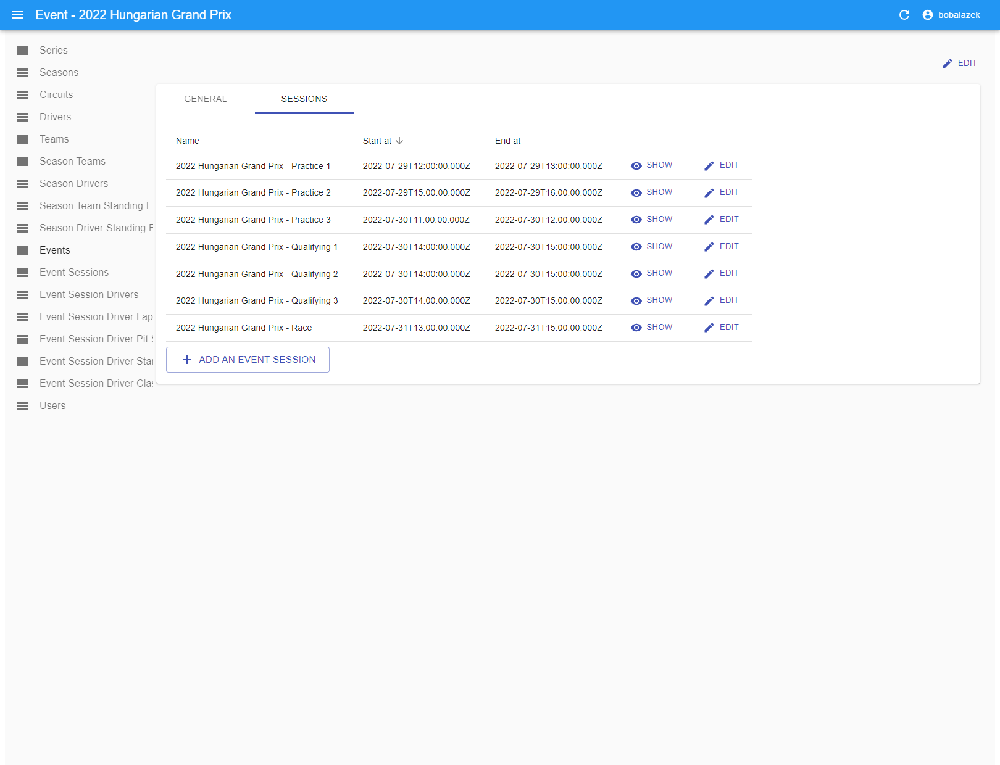
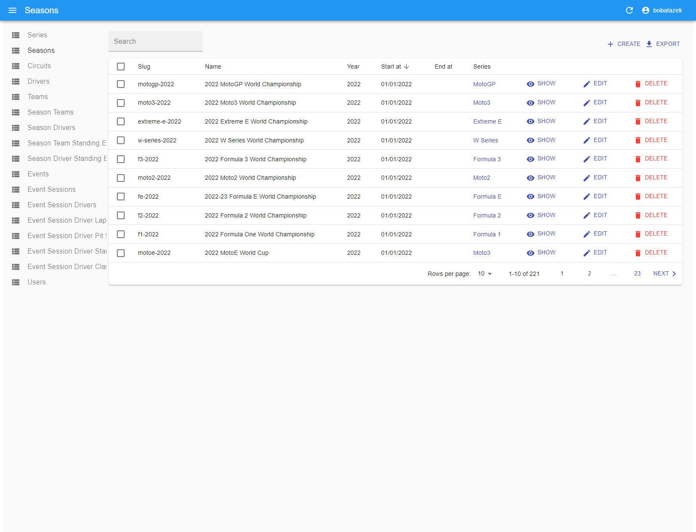
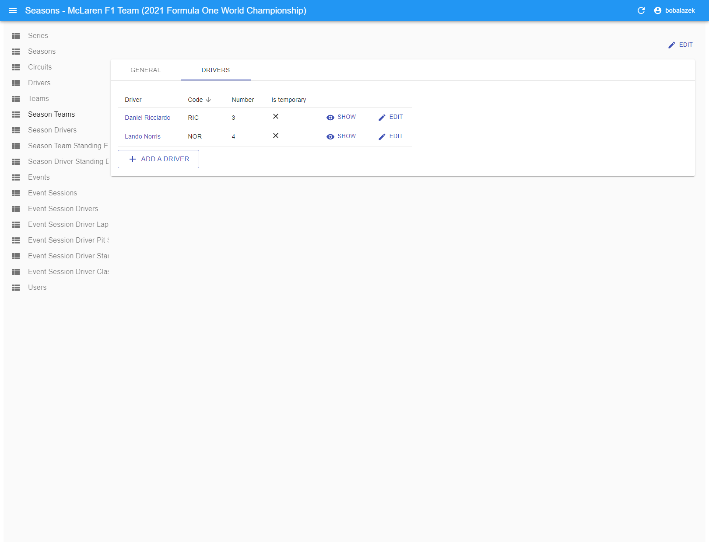
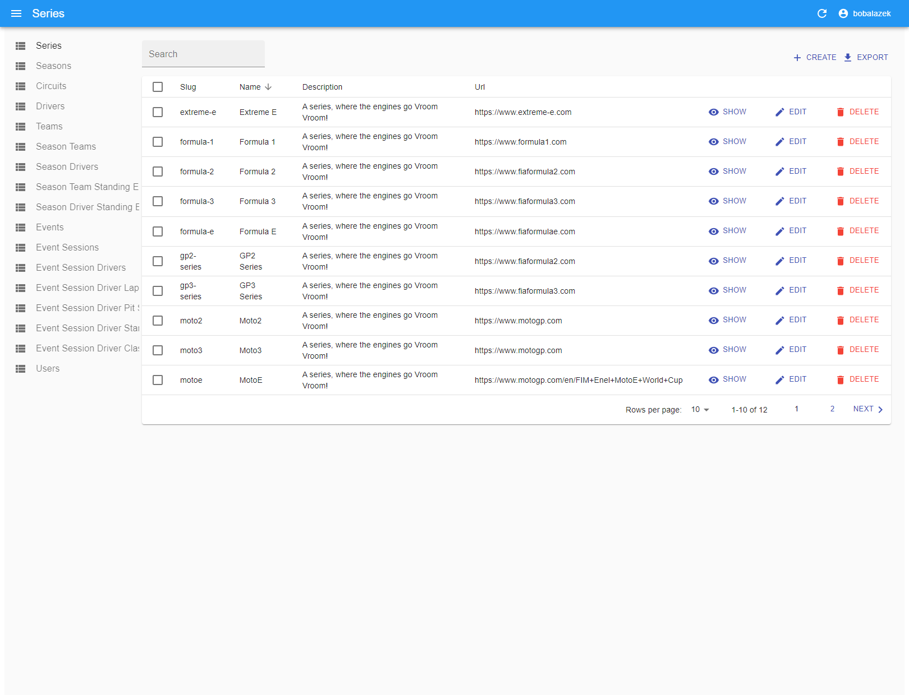

# EGVV - Engine Goes Vroom Vroom

A racing news platform aggregator.

**This project is still in active development**

## Stack

- NX for the monorepo
- Prisma as the ORM
- PostgreSQL as the database
- React Admin for the admin area
- NestJS & GraphQL for the API
- NextJS & Mantine UI for the web app
- Puppeteer for web scrapping

## Getting started

Just runn `npm install` and you are good to go!

## Development

Once you've installed all the dependencies, you simply run `yarn dev` in your terminal and visit [http://localhost:4200](http://localhost:4200) for the website, and [http://localhost:4300](http://localhost:4300) for the admin area.

## Commands

- `yarn dev`
- `yarn cli scrape-f1-data --year 2021`

## Screenshots

